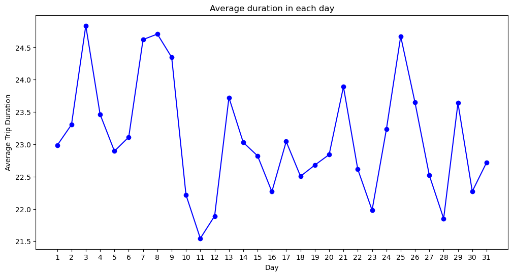
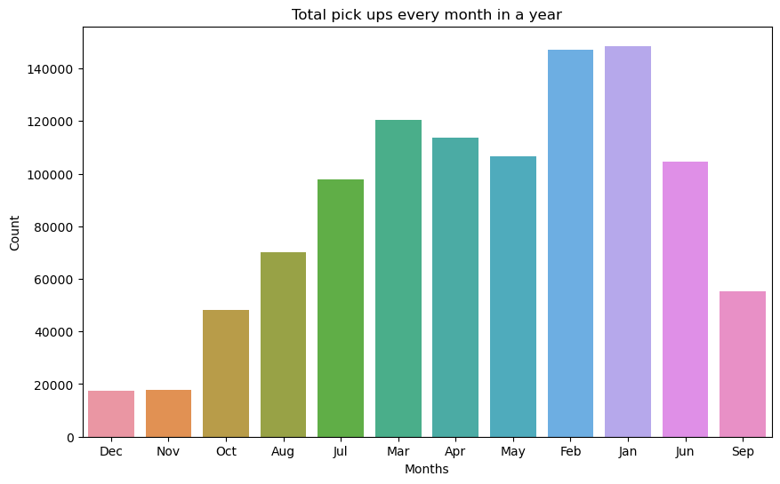
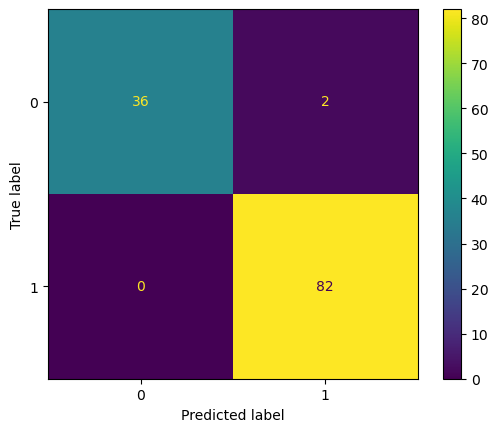
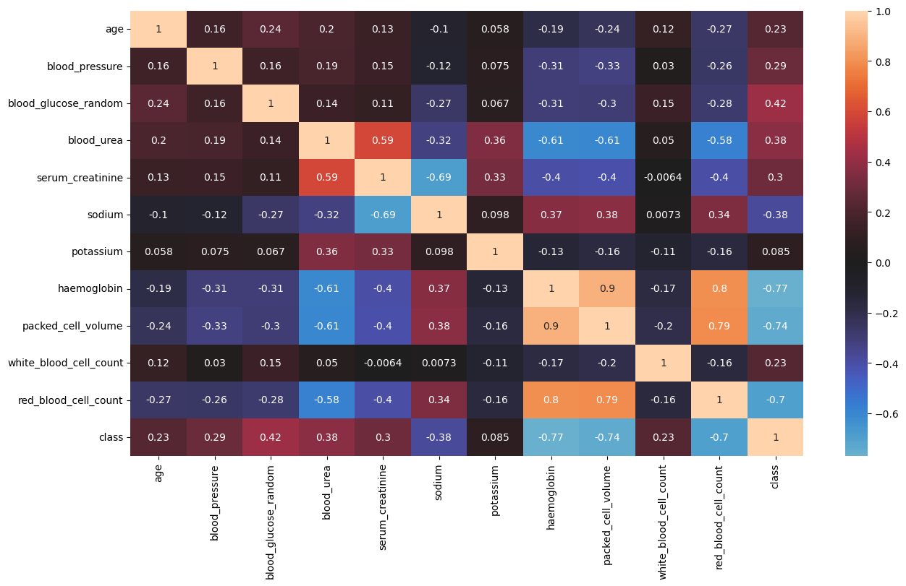
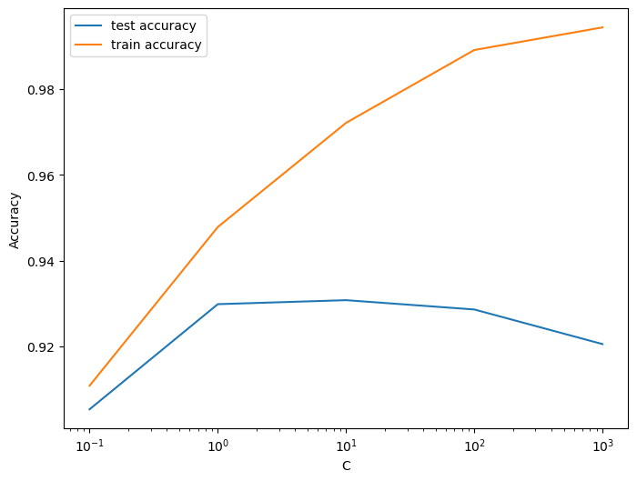
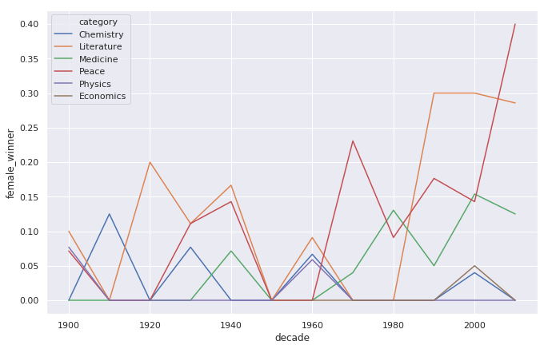

# Abhinav's Data Science portfolio 

Explore my projects that demonstrate my proficiency in tasks such as importing data, data cleansing, manipulating data, and conducting exploratory data analysis, model building & optimising model performace etc..

# [Project 1: Sentiment Analysis of Financial News using NLTK](https://github.com/abhinavpeddi95/Sentiment-Analysis-of-Financial-News.git)
The project performed sentiment analysis on financial news articles using the NLTK library. Various models, including Logistic regression, SVM, XGBoost, KNN, and Random Forest, were employed for sentiment classification. Hyperparameter tuning techniques were applied to optimize accuracy. The project successfully implemented sentiment analysis, accurately classifying sentiment as positive, negative, or neutral based on the textual content. Linear support vector machine models yielded the best results overall.

# [Project 2: Seoul Bike Rental Demand Prediction](https://github.com/abhinavpeddi95/Seoul-bike-prediction.git)
The project uses historical bike rental records from the Seoul Bike Sharing System to train machine learning models for demand prediction. The goal is to predict bike rental demand. The dataset is preprocessed by scaling the data with StandardScaler. Various models, including Linear Regression, XGBoost Regressor, and Random Forest Regressor, are used. Hyperparameter optimization is specifically applied to the Random Forest Regressor model. The project successfully trains and evaluates these models, utilizing techniques and algorithms to enhance predictive performance.

 

# [Project 3: Chronic_Kidney_Disease classification](https://github.com/abhinavpeddi95/Chronic_Kidney_Disease.git)
The project uses patient health attribute data to train and evaluate classification models for chronic kidney disease (CKD). The task is to classify instances of CKD using the dataset and multiple classification models. The dataset undergoes data cleaning, exploratory data analysis (EDA), and missing value treatment. Various classification models, including Random Forest, Ada Boost, CatBoost, Decision Tree, and Extra Tree Classifiers, are employed for CKD classification. Model performance is evaluated using accuracy score, confusion matrix, and classification report. The project successfully applies machine learning techniques to classify instances of CKD using patient health attribute data. The dataset is preprocessed through data cleaning, EDA, and missing value treatment. Various classification models, such as Random Forest, Ada Boost, CatBoost, Decision Tree, and Extra Tree Classifiers, are utilized. Model performance is assessed using accuracy score, confusion matrix, and classification report.

 

# [Project 4: Email Spam Classifier](https://github.com/abhinavpeddi95/Email-Spam-Classifier.git)
The project aims to build a machine learning model that can accurately classify emails as either spam or not spam based on their content and characteristics. The dataset used in this project is sourced from the spam_detection. It includes a collection of emails labeled as spam or ham (non-spam). The dataset consists of 4602 rows and 58 columns

 

# Data Analysis portfolio 

# [Project 1: Exploring-the-NYC-Airbnb-Market](https://github.com/abhinavpeddi95/DA_Exploring-the-NYC-Airbnb-Market)

In this project, I have applied <b> Data Importing and Cleaning skills </b> to uncover below insights about the Airbnb market in New York City.

*What is the average price, per night, of an Airbnb listing in NYC?
How does the average price of an Airbnb listing, per month, compare to the private rental market?
How many adverts are for private rooms?
How do Airbnb listing prices compare across the five NYC boroughs?t

# [Project 2: COVID Data Analysis using PowerBI](https://github.com/abhinavpeddi95/COVID-data-Analaysis.git)

Designed a Power BI dashboard to find out which ethnicity has impacted most in the United States during the COVID pandemic using 3 datasets collected from three different sources and are in two formats xlsx and web. Three datasets are loaded into Power BI and removed null and empty spaces and identified outliers’ & extreme vales and treated them as per requirements. Later, normalised datasets into different tables and integrated them using star schema approach with two fact tables. Used R script and Power BI to Interpret the results as per the requirements and conducted manual testing to check datasets has any more outliers or null values and to see whether visualizations are plotted from appropriate tables. Finally, found that non-hispanic latino and hispanic latino ethic group afftected the most in United Sates.

# [Project 3: A Visual History of Nobel Prize Winners](https://github.com/abhinavpeddi95/A-Visual-history-of-Nobel-prize-winners)

The goal is to explore patterns and trends over 100 years worth of Nobel Prize winners using <b> Data Manipulation and visualization skills </b>, and answering key questions

*Which country got the most Nobel prizes
What is the gender of a typical Nobel Prize winner? 3.The first woman to win the Nobel Prize
How old are you when you get the prize?
Age differences between prize categories

 

# [Project 4: Exploring the History of LEGO](https://github.com/abhinavpeddi95/Exploring-the-Evolution-of-Lego-.git)

In this project, we are going to explore a key development in the history of Lego: the introduction of licensed sets such as Star Wars, Super Heroes, and Harry Potter and going to findout answers for below questions.

What percentage of all licensed sets ever released were Star Wars themed?
In which year was Star Wars not the most popular licensed theme (in terms of number of sets released that year)?

